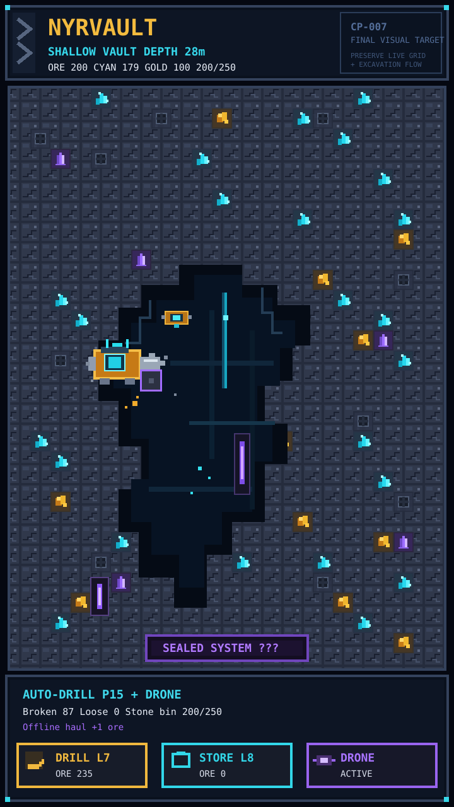

# NYRVAULT

**Pixel Idle Adventure** — an Android-first portrait mining game built around active destruction, automation, collection, hidden systems, guardians and long-term progression.

> This is the **public showcase repository**. The game source code, build system and internal development material are kept in a separate private repository.

  

## Current development state

**CP-005 — Worlds & Guardian — ACTIVE**

The playable foundation already includes mining, auto-drill, storage upgrades, autonomous drone progression, relic collection and gradually revealed systems such as bombs, forging, drone builds and deep technology.

The current checkpoint expands Nyrvault beyond the first mine with multiple underground worlds and the first Core Guardian.

## Final visual direction

The CP-007 visual direction is **locked**.

The final game keeps the existing destructible cellular mine and free-form tunnels, but upgrades the presentation into premium authored pixel art:

- dark engineered stone and buried machinery;
- cyan crystal and warm gold deposits;
- ancient violet technology;
- an industrial mining mech and autonomous drones;
- chunky destruction debris, sparks and pickup trails;
- compact pixel UI designed for portrait phones.

See [VISUAL_TARGET.md](docs/VISUAL_TARGET.md).

## Roadmap

See [ROADMAP.md](ROADMAP.md).

Core progression:

`BREAK → COLLECT → UPGRADE → AUTOMATE → DISCOVER → GUARDIAN → DESCEND → CORE COLLAPSE → REPEAT STRONGER`

## Live roadmap

https://fantest.win/nyrvault/

## Source availability

Nyrvault is **not an open-source project**. This repository intentionally contains public documentation, roadmap material and approved visual assets only. Game source code is not distributed here.

## Status

Development is active. Public material will be updated from the private canonical development repository through an allowlist-only publishing process.
